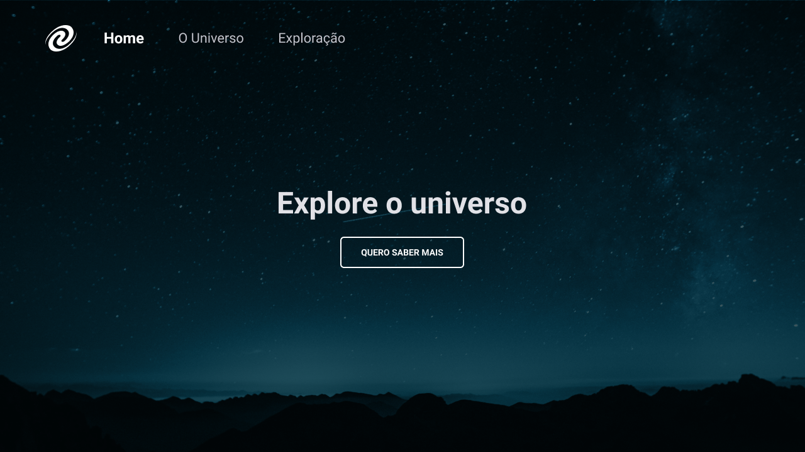
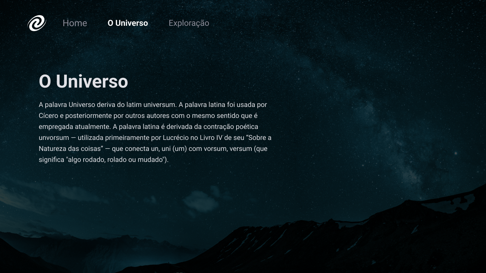

<h1 align="center"> Conceito de SPA  (Single Page Applications) </h1>

Desenvolvido por Rafael Lorenzetti (loren175). 
Layout UI/UX RocketSeat.

  <a href="#-tecnologias">Tecnologias</a>&nbsp;&nbsp;&nbsp;|&nbsp;&nbsp;&nbsp;
  <a href="#-projeto">Projeto</a>&nbsp;&nbsp;&nbsp;|&nbsp;&nbsp;&nbsp;
  <a href="#-layout">Layout</a>&nbsp;&nbsp;&nbsp;|&nbsp;&nbsp;&nbsp;
  <a href="#memo-licença">Licença</a>

  
  
  

 

## 🚀 Tecnologias

Esse projeto foi desenvolvido com as seguintes tecnologias:

- HTML
- CSS
- Node
- JavaScript
- Git e Github

## 💻 Projeto

Página contendo o conceito SPA. 
Aplicações baseadas em frameworks SPA funcionam de maneira diferente, pois nelas não há a necessidade 
    de se fazer requisições para carregamento de novas páginas. A aplicação seria “carregada” por inteiro 
    na primeira requisição, onde todo o HTML, CSS e JavaScript necessários seriam carregados de uma vez. 
    A partir deste momento, quando novas páginas precisassem ser carregadas, estas seriam carregadas através 
    de rotinas JavaScript, retirando a necessidade de requisições para o servidor com a finalidade de obter 
    o novo conteúdo a ser renderizado.

## 🔖 Layout

Você pode visualizar o layout do projeto através [DESSE LINK](https://www.figma.com/file/4SqKNrixWzPRxE5fNZcxON/%5BDesafios-Explorer%5D-SPA-Universe-(Copy)?node-id=0%3A1&t=Pv9DUfdZkcH3qnWL-0). É necessário ter conta no [Figma](https://figma.com) para acessá-lo.

## 📚 Licença

Esse projeto está sob a licença MIT.

---